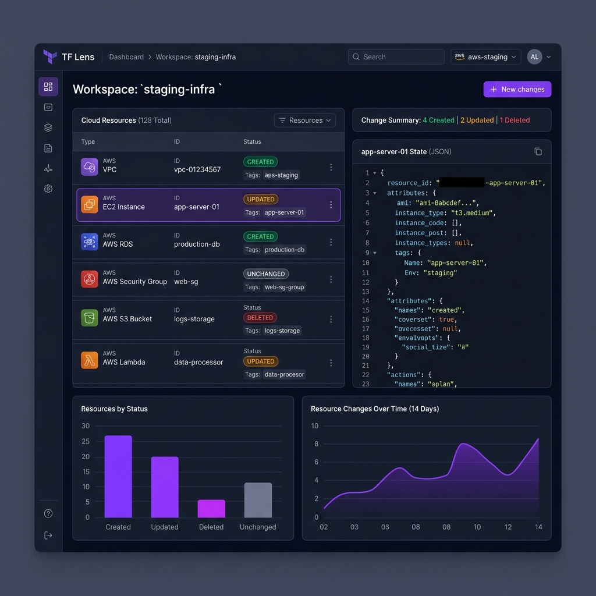

# TF Lens — Terraform Plan & State Viewer



Interactive web app for exploring Terraform plan and state JSON files. Upload a plan or state file to browse resources, filter by action/status/type/module, and inspect values.

All parsing runs in the browser. Unknown or partially malformed resources are shown with warnings instead of crashing the app.

## Generate plan JSON

From a regional stack:

```bash
cd stacks/regional/dev/ap-northeast-2
terraform plan -out=tfplan
terraform show -json tfplan > plan_output.json
```

## Generate state JSON

Either export show-json state:

```bash
terraform show -json > state_output.json
```

Or upload a raw `terraform.tfstate` file directly — no need to rename it to `.json`. The State Viewer accepts both `.tfstate` and `.json` files.

## Run locally

```bash
cd tools/terraform-plan-viewer
npm install
npm run dev
```

Open the URL shown in the terminal (typically `http://localhost:5173`).

- **Plan Viewer** (`/plan`) — upload `plan_output.json` or click **Load sample**
- **State Viewer** (`/state`) — upload `terraform.tfstate`, state JSON, or click **Load sample state**

## Build

```bash
npm run build
npm run preview
```

## Features

### Plan Viewer

- Summary dashboard with action counts and top resource types
- Sortable, filterable resource table
- Resource detail panel with before/after JSON trees
- Modules, outputs, and variables tabs
- Graceful handling of unknown resource types and parse failures

### State Viewer

- Summary dashboard with resource status counts (OK, tainted, deposed, missing, failed)
- Sortable, filterable resource table with current state attributes
- Resource detail panel with sensitive value masking
- Modules and outputs tabs
- Issues tab for check failures, tainted resources, and parse problems
- Supports raw `terraform.tfstate` and `terraform show -json` formats
